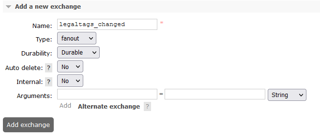

## Service Configuration for Baremetal

## Run args

In order to run Legal with Java 17 additional run args must be provided:

```bash
--add-opens java.base/java.lang=ALL-UNNAMED --add-opens  java.base/java.lang.reflect=ALL-UNNAMED
```
In order to provide Driver implementations, more run args are needed:

```bash
-Dloader.path=plugins/ -Dloader.main=org.opengroup.osdu.legal.LegalApplication
```

Full command:

```bash
java --add-opens java.base/java.lang=ALL-UNNAMED \
         --add-opens java.base/java.lang.reflect=ALL-UNNAMED \
         -Djava.security.egd=file:/dev/./urandom \
         -Dserver.port=${PORT} \
         -Dlog4j.formatMsgNoLookups=true \
         -Dloader.path=plugins/ \
         -Dloader.main=org.opengroup.osdu.legal.LegalApplication \
         -jar /app/legal-${PROVIDER_NAME}.jar
```

## Environment variables:

Define the following environment variables.

Must have:

| name                                      | value         | description                                                                                                                                                                                                                                                                                              | sensitive? | source |
|-------------------------------------------|---------------|----------------------------------------------------------------------------------------------------------------------------------------------------------------------------------------------------------------------------------------------------------------------------------------------------------|------------|--------|
| `<POSTGRES_PASSWORD_ENV_VARIABLE_NAME>`   | ex `password` | Potgres user, name of that variable not defined at the service level, the name will be received through partition service. Each tenant can have it's own ENV name value, and it must be present in ENV of Legal service, see [Partition properties set](#Properties-set-in-Partition-service)            | yes        | -      |
| `<SEAWEEDFS_ACCESS_KEY_ENV_VARIABLE_NAME>`| ex `password` | S3 secret key, name of that variable not defined at the service level, the name will be received through partition service. Each tenant can have it's own ENV name value, and it must be present in ENV of Legal service, see [Partition properties set](#Properties-set-in-Partition-service)           | false      | -      |
| `<AMQP_PASSWORD_ENV_VARIABLE_NAME>`       | ex `password` | RabbitMQ password, name of that variable not defined at the service level, the name will be received through partition service. Each tenant can have it's own ENV name value, and it must be present in ENV of Legal service, see [Partition properties set](#Properties-set-in-Partition-service)       | false      | -      |
| `<AMQP_ADMIN_PASSWORD_ENV_VARIABLE_NAME>` | ex `password` | RabbitMQ Admin password, name of that variable not defined at the service level, the name will be received through partition service. Each tenant can have it's own ENV name value, and it must be present in ENV of Legal service, see [Partition properties set](#Properties-set-in-Partition-service) | false      | -      |

Defined in default application property file but possible to override:

| name                                     | value                                  | description                                                       | sensitive? | source                              |
|------------------------------------------|----------------------------------------|-------------------------------------------------------------------|------------|-------------------------------------|
| `LOG_PREFIX`                             | `legal`                                | Logging prefix                                                    | no         | -                                   |
| `AUTHORIZE_API`                          | `http://entitlements/entitlements/v1`  | Entitlements API endpoint                                         | no         | output of infrastructure deployment | |
| `PARTITION_API`                          | ex `http://partition/api/partition/v1` | Partition service endpoint                                        | no         | -                                   |
| `PARTITION_AUTH_ENABLED`                 | `false`                                | Disable auth token provisioning for requests to Partition service | no         | -                                   |
| `PARTITION_PROPERTIES_LEGAL_BUCKET_NAME` | ex `legal.bucket.name`                 | Name of partition property for legal bucket name value            | yes        | -                                   |
| `MANAGEMENT_ENDPOINTS_WEB_BASE`          | ex `/`                                 | Web base for Actuator                                             | no         | -                                   |
| `MANAGEMENT_SERVER_PORT`                 | ex `8081`                              | Port for Actuator                                                 | no         | -                                   |


### Properties set in Partition service:

Note that properties can be set in Partition as `sensitive` in that case in property `value` should be present not value itself, but ENV variable name.
This variable should be present in environment of service that need that variable.

Example:
```
    "elasticsearch.port": {
      "sensitive": false, <- value not sensitive 
      "value": "9243"  <- will be used as is.
    },
      "elasticsearch.password": {
      "sensitive": true, <- value is sensitive 
      "value": "ELASTIC_SEARCH_PASSWORD_OSDU" <- service consumer should have env variable ELASTIC_SEARCH_PASSWORD_OSDU with elastic search password
    }
```


## Postgres configuration:

### Properties set in Partition service:

**prefix:** `osm.postgres`

It can be overridden by:

- through the Spring Boot property `osm.postgres.partition-properties-prefix`
- environment variable `OSM_POSTGRES_PARTITION_PROPERTIES_PREFIX`

**Propertyset:**

| Property                         | Description |
|----------------------------------|-------------|
| osm.postgres.datasource.url      | server URL  |
| osm.postgres.datasource.username | username    |
| osm.postgres.datasource.password | password    |

<details><summary>Example of a definition for a single tenant</summary>

```

curl -L -X PATCH 'http://partition.com/api/partition/v1/partitions/opendes' -H 'data-partition-id: opendes' -H 'Authorization: Bearer ...' -H 'Content-Type: application/json' --data-raw '{
  "properties": {
    "osm.postgres.datasource.url": {
      "sensitive": false,
      "value": "jdbc:postgresql://127.0.0.1:5432/postgres"
    },
    "osm.postgres.datasource.username": {
      "sensitive": false,
      "value": "postgres"
    },
    "osm.postgres.datasource.password": {
      "sensitive": true,
      "value": "<POSTGRES_PASSWORD_ENV_VARIABLE_NAME>" <- (Not actual value, just name of env variable)
    }
  }
}'

```

</details>

### Schema configuration:

```
CREATE TABLE <partitionId>."LegalTagOsm"(
id text COLLATE pg_catalog."default" NOT NULL,
pk bigint NOT NULL GENERATED ALWAYS AS IDENTITY PRIMARY KEY,
data jsonb NOT NULL,
CONSTRAINT LegalTagOsm_id UNIQUE (id)
);
CREATE INDEX LegalTagOsm_dataGin ON <partitionId>."LegalTagOsm" USING GIN (data);

```

Example of filling table with LegalTag

```

INSERT INTO <partitionId>."LegalTagOsm"(
id, data)
VALUES ('726612843', '{
  "id": 726612843,
  "name": "opendes-gae-integration-test-1639485896236",
  "isValid": true,
  "properties": {
    "COO": [
      "US"
    ],
    "dataType": "Transferred Data",
    "contractId": "A1234",
    "originator": "MyCompany",
    "personalData": "No Personal Data",
    "expirationDate": "Dec 31, 9999",
    "exportClassification": "EAR99",
    "securityClassification": "Public"
  },
  "description": ""
}');

```

## RabbitMQ configuration:

### Properties set in Partition service:

**prefix:** `oqm.rabbitmq`

It can be overridden by:

- through the Spring Boot property `oqm.rabbitmq.partition-properties-prefix`
- environment variable `OQM_RABBITMQ_PARTITION_PROPERTIES_PREFIX`

**Property Set** (for two types of connection: messaging and admin operations):

| Property                    | Description              |
|-----------------------------|--------------------------|
| oqm.rabbitmq.amqp.host      | messaging hostname or IP |
| oqm.rabbitmq.amqp.port      | - port                   |
| oqm.rabbitmq.amqp.path      | - path                   |
| oqm.rabbitmq.amqp.username  | - username               |
| oqm.rabbitmq.amqp.password  | - password               |
| oqm.rabbitmq.admin.schema   | admin host schema        |
| oqm.rabbitmq.admin.host     | - host name              |
| oqm.rabbitmq.admin.port     | - port                   |
| oqm.rabbitmq.admin.path     | - path                   |
| oqm.rabbitmq.admin.username | - username               |
| oqm.rabbitmq.admin.password | - password               |

<details><summary>Example of a single tenant definition</summary>

```

curl -L -X PATCH 'https://dev.osdu.club/api/partition/v1/partitions/opendes' -H 'data-partition-id: opendes' -H 'Authorization: Bearer ...' -H 'Content-Type: application/json' --data-raw '{
  "properties": {
    "oqm.rabbitmq.amqp.host": {
      "sensitive": false,
      "value": "localhost"
    },
    "oqm.rabbitmq.amqp.port": {
      "sensitive": false,
      "value": "5672"
    },
    "oqm.rabbitmq.amqp.path": {
      "sensitive": false,
      "value": ""
    },
    "oqm.rabbitmq.amqp.username": {
      "sensitive": false,
      "value": "guest"
    },
    "oqm.rabbitmq.amqp.password": {
      "sensitive": true,
      "value": "<AMQP_PASSWORD_ENV_VARIABLE_NAME>" <- (Not actual value, just name of env variable)
    },

     "oqm.rabbitmq.admin.schema": {
      "sensitive": false,
      "value": "http"
    },
     "oqm.rabbitmq.admin.host": {
      "sensitive": false,
      "value": "localhost"
    },
    "oqm.rabbitmq.admin.port": {
      "sensitive": false,
      "value": "9002"
    },
    "oqm.rabbitmq.admin.path": {
      "sensitive": false,
      "value": "/api"
    },
    "oqm.rabbitmq.admin.username": {
      "sensitive": false,
      "value": "guest"
    },
    "oqm.rabbitmq.admin.password": {
      "sensitive": true,
      "value": "<AMQP_ADMIN_PASSWORD_ENV_VARIABLE_NAME>" <- (Not actual value, just name of env variable)
    }
  }
}'

```

</details>

### Exchanges & queues configuration:

At RabbitMq should be created exchange with name:

**name:** `legaltags-changed`

It can be overridden by:

- through the Spring Boot property `pub-sub-legal-tags-topic`
- environment variable `PUB_SUB_LEGAL_TAGS_TOPIC`

Legal service responsible for publishing only.
Consumer side `legaltags-changed` topic configuration located in
[Storage Baremetal Rabbit documentation](https://community.opengroup.org/osdu/platform/system/storage/-/tree/master/provider/storage-gc/docs/anthos#exchanges-and-queues-configuration)



## S3 (SeaweedFS) configuration:

### Properties set in Partition service:

**prefix:** `obm.s3`

It can be overridden by:

- through the Spring Boot property `obm.s3.partition-properties-prefix`
- environment variable `OBM_S3_PARTITION_PROPERTIES_PREFIX`

**Propertyset** (for two types of connection: messaging and admin operations):

| Property          | Description |
|-------------------|-------------|
| obm.s3.endpoint   | - url       |
| obm.s3.accessKey  | - username  |
| obm.s3.secretKey  | - password  |
| obm.s3.region     | - region    |

<details><summary>Example of a single tenant definition</summary>

```
curl -L -X PATCH 'https://dev.osdu.club/api/partition/v1/partitions/opendes' -H 'data-partition-id: opendes' -H 'Authorization: Bearer ...' -H 'Content-Type: application/json' --data-raw '{
  "properties": {
    "obm.s3.endpoint": {
      "sensitive": false,
      "value": "http://localhost:8333"
    },
    "obm.s3.accessKey": {
      "sensitive": true,
      "value": "your-access-key"
    },
    "obm.s3.secretKey": {
      "sensitive": true,
      "value": "SEAWEEDFS_SECRETKEY_ENV_VARIABLE_NAME>" <- (Not actual value, just name of env variable)"
    },
    "obm.s3.region": {
      "sensitive": false,
      "value": "us-east-1"
    }
  }
}'
```

</details>

## Object store configuration <a name="ObjectStoreConfig"></a>
### Used Technology
SeaweedFS (or any other supported by OBM)

### Per-tenant buckets configuration
These buckets must be defined in tenants’ dedicated object store servers. OBM connection properties of these servers (url, etc.) are defined as specific properties in tenants’ PartitionInfo registration objects at the Partition service as described in accordant sections of this document.

<table>
  <tr>
   <td>Bucket Naming template 
   </td>
   <td>Permissions required
   </td>
  </tr>
  <tr>
   <td>&lt;PartitionInfo.name>-legal-service-configuration

<strong>OR</strong>
<p>
&lt;PartitionInfo.projectId>-&lt;PartitionInfo.name>-legal-service-configuration
   </td>
   <td>CreateBucket, CRUDObject
   </td>
  </tr>
</table>

### Running E2E Tests

This section describes how to run cloud OSDU E2E tests (testing/legal-test-baremetal).

You will need to have the following environment variables defined.

| name                                 | value                                            | description                                                                                                                                                                                                                    | sensitive?                              | source |
|--------------------------------------|--------------------------------------------------|--------------------------------------------------------------------------------------------------------------------------------------------------------------------------------------------------------------------------------|-----------------------------------------|--------|
| `HOST_URL`                           | `http://localhsot:8080/api/legal/v1/`            | -                                                                                                                                                                                                                              | yes                                     | -      |
| `MY_TENANT`                          | `osdu`                                           | OSDU tenant used for testing                                                                                                                                                                                                   | yes                                     | -      |
| `SKIP_HTTP_TESTS`                    | ex `true`                                        | jetty server returns 403 when running locally when deployed jettyserver is not used and the app returns a 302 so just run against deployed version only when checking http -> https redirects. Use 'true' for Google Cloud Run | yes                                     | -      |
| `BAREMETAL_PROJECT_ID`               | ex `osdu-anthos`                                 | project id used to specify bucket name if `ENABLE_FULL_BUCKET_NAME`=true                                                                                                                                                       | no                                      | -      |
| `TEST_OPENID_PROVIDER_CLIENT_ID`     | `********`                                       | Client Id for `$INTEGRATION_TESTER`                                                                                                                                                                                            | yes                                     | --     |
| `TEST_OPENID_PROVIDER_CLIENT_SECRET` | `********`                                       |                                                                                                                                                                                                                                | Client secret for `$INTEGRATION_TESTER` | --     |
| `TEST_OPENID_PROVIDER_URL`           | `https://keycloak.com/auth/realms/osdu`          | OpenID provider url                                                                                                                                                                                                            | yes                                     | --     |
| `TEST_MINIO_ACCESS_KEY`              | ex `true`                                        | Minio access key                                                                                                                                                                                                               | no                                      | -      |
| `TEST_MINIO_SECRET_KEY`              | `********`                                       | Minio secret                                                                                                                                                                                                                   | yes                                     | --     |
| `TEST_MINIO_URL`                     | `https://s3.ref.gc.gnrg-osdu.projects.epam.com/` | Minio url                                                                                                                                                                                                                      | --                                      |
| `PARTITION_API`                      | ex `http://localhost:8080/api/partition/v1 `     | Partition service host                                                                                                                                                                                                         | no                                      | --     |


**Entitlements configuration for integration accounts**

| INTEGRATION_TESTER                                                                                                                                   |
|------------------------------------------------------------------------------------------------------------------------------------------------------|
| users<br/>service.entitlements.user<br/>service.legal.admin<br/>service.legal.editor<br/>service.legal.user<br/>data.test1<br/>data.integration.test |

Execute following command to build code and run all the integration tests:

```bash
# Note: this assumes that the environment variables for integration tests as outlined
#       above are already exported in your environment.
$ (cd testing/legal-test-core/ && mvn clean install)
$ (cd testing/legal-test-baremetal/ && mvn clean test)
```

## License

Copyright © Google LLC
Copyright © EPAM Systems

Licensed under the Apache License, Version 2.0 (the "License");
you may not use this file except in compliance with the License.
You may obtain a copy of the License at

[http://www.apache.org/licenses/LICENSE-2.0](http://www.apache.org/licenses/LICENSE-2.0)

Unless required by applicable law or agreed to in writing, software
distributed under the License is distributed on an "AS IS" BASIS,
WITHOUT WARRANTIES OR CONDITIONS OF ANY KIND, either express or implied.
See the License for the specific language governing permissions and
limitations under the License.